# Visual Exploration of Reddit's Top Communities: A Decade of Engagement (2011–2024)

**DAS732: Data Visualization — Term 1 (2026–27) — Programming Assignment 1**

**Team:** Silica
**Members:** Sidhanth Prabhu (BT2024027, team lead) · Shrey Modi (BT2024125) · Parthsarathi Samanta (BT2024083)
**Date:** September 2026

---

## 1. Introduction

Reddit is organised into thousands of topic communities ("subreddits"), each with its own culture, content rules, and audience behaviour. The front page of the internet, however, is not one uniform place: a meme community and a personal-finance community can both produce posts with 100,000+ upvotes, yet the way their audiences *engage* with those posts may be completely different — one is consumed with a click, the other is argued over for days.

This project visually explores the **Kaggle dataset "Reddit Top Posts: 50-Subreddit Analysis 2011–2024"**, which contains the **all-time top ~1,000 posts (by score) of each of Reddit's 50 largest subreddits** — 49,266 posts in total, created between September 2011 and September 2024. Because every post in the corpus is already a "success", the interesting question is not *why* posts succeed, but **how the biggest communities differ in the way they generate engagement, and how that changed over a decade of Reddit's history**.

Our central question is:

> **What does a decade (2011–2024) of all-time top posts reveal about how Reddit's 50 largest communities generate engagement — who discusses versus who consumes, what media succeeds where, and how the content landscape behind these hits changed over time?**

To answer it, we defined three cohesive sets of visualization tasks (one per team member, per the assignment's task-based structure): an **overview and synthesis** of the corpus (led by the team lead, who also built the data pipeline), a **comparison** of engagement styles across communities, and an **exploration of temporal trends and relationships** among engagement variables. The sections below describe the dataset, our preparation pipeline, the tasks, the fourteen visualizations that form the final data story, and the inferences we draw from them.

## 2. Dataset Description

**Source.** Kaggle — *Reddit Top Posts: 50-Subreddit Analysis 2011–2024* (author: Sachin Kanchan). The data was extracted via Reddit's official API in **September 2024**; each of the 50 CSV files contains the **top ~1,000 posts of all time by net score** of one subreddit (the API caps results at 1,000 posts per listing). The 50 subreddits were selected by subscriber count and span entertainment, news, science, advice, and hobby communities. No personally identifiable information is included (the post author field was removed by the dataset creator).

**Shape.** 49,266 posts × 19 raw columns; 871–1,000 posts per subreddit; creation dates from 2011-09-27 to 2024-09-11 (UTC). There are no duplicate post IDs and no missing values in the core engagement fields.

**Key variables used.**

| Variable | Meaning | Role in our story |
|---|---|---|
| `score` | Net upvotes (upvotes − downvotes) | Approval / popularity |
| `num_comments` | Number of comments | Participation / discussion |
| `upvote_ratio` | Share of votes that are upvotes (0.56–1.00) | Consensus / contestedness |
| `num_crossposts` | Times the post was shared to other subreddits | Spread / virality |
| `post_type` | text / image / link / video | Content form |
| `domain`, `domain_class` (derived) | Where linked media is hosted | Platform migration |
| `created_utc` | Post creation timestamp | All temporal analysis |
| `subreddit` | Community (50 values) | All comparisons |
| `subscribers` | Subscribers **at collection time (Sep 2024)** | Community size context |

**Structural characteristics that constrain interpretation** (verified from the data and the dataset documentation):

1. **Selection bias by construction.** The corpus contains only each community's *successes*. We therefore make no causal claims about "what makes a post succeed"; instead we characterise *how successes differ* across communities and time.
2. **Accumulation-time bias.** Upvotes accrue over years. Recent posts (2023–24) are under-represented among all-time top posts and their scores are still growing; very old posts (pre-2014) are few because Reddit itself was small then. We interpret the time axis with this in mind.
3. **`subscribers` is a 2024 snapshot**, constant per subreddit — it can contextualise community *size* but must never be read historically.
4. **Redundant / dead columns.** `num_awards` is zero for 100% of rows; `crosspost_subreddits` is 99.35% missing; `body` is 82.8% missing; `is_bot` is 8.5% missing with only 28 true values; `is_megathread` is true for 21 posts. These were dropped (Section 3).

## 3. Data Preparation

The full pipeline is reproducible via `src/02_prepare.py` (raw data in `data/raw/`, outputs in `data/processed/`, and an auto-generated decision log in `data/processed/preprocessing_log.md`). The original dataset is kept untouched in `data/raw/`.

1. **Loading.** The 50 per-subreddit CSVs are merged into one table; the source file name is retained for provenance.
2. **Date parsing.** `created_utc` uses two formats: a standard `YYYY-MM-DD HH:MM:SS` timestamp, and — for all 987 AskReddit rows — an Excel-style `M/D/YYYY H:MM` format. Both are parsed explicitly; all 49,266 timestamps parse successfully.
3. **Column drops (no information or unusable):** `num_awards` (100% zeros), `crosspost_subreddits` (99.35% missing), `body` (82.8% missing; the title is always present and is the universal text surface), `is_bot`, `is_megathread` (near-constant).
4. **Derived variables.**
   - `cpi` = `num_comments / score` — **comments per upvote**, our measure of *discussion intensity*. We report it as **comments per 1,000 upvotes** (`cpi1k`) for readability. Medians are used throughout because both inputs are heavily right-skewed.
   - `era` — five creation-year bins (≤2015, 2016–17, 2018–19, 2020–21, 2022–24) chosen to balance sample sizes given the coverage skew (778 / 8,013 / 16,561 / 17,772 / 6,142 posts).
   - `domain_class` — coarse hosting classifier: *self post, reddit-native (i.redd.it / v.redd.it), imgur, youtube, other video hosts, other external, no link*.
   - `title_len`, `is_question` (title ends in "?"), `year`, `month`, `hour_utc`.
5. **Community-level aggregation.** `subreddit_summary.csv` holds one row per subreddit with medians of the skewed engagement metrics and post-type shares.
6. **Outlier policy.** **No observations were removed or winsorised.** The corpus is the top tail by construction, so extreme values are the object of study; visualizations use log scales and aggregations use medians. (Robustness check: ranking subreddits by mean vs. median `cpi` gives rank correlation 0.99 — our comparison findings are not outlier artefacts.)
7. **Duplicates / missing.** Zero duplicate post IDs; no missing values in any field used.

## 4. Visualization Tasks

Following the assignment's requirement that the implementation start with a question answerable by visualization tasks (task terminology after Schulz et al. [1]: overview, trends, search, compare, etc.), we decomposed the central question into **three cohesive task sets — one per member** — over cohesive variable subsets; the team lead's set (Task Set 1) additionally owns data preparation and the integration of the other two sets' findings. Tasks we *tried but did not keep* are listed in the Appendix.

### Task Set 1 — Data preparation, corpus overview & synthesis (Member A — Sidhanth, team lead)

*Summarise the corpus, own the pipeline, and integrate the other two task sets' findings.*

- **T1.1 (overview / distribution):** What does an all-time top post look like — distributions of score, comments, upvote ratio, and discussion intensity?
- **T1.2 (overview / coverage):** When were these posts created? How does coverage vary by year, and what biases does that create?
- **T1.3 (trend):** How has the typical score of a top post changed with Reddit's growth — the "price of fame"?
- **T1.4 (cluster / synthesise):** Do the 50 communities fall into a small number of engagement profiles? (integrates Task Sets 2 and 3)
- **T1.5 (compare / synthesise):** Do communities' all-time lists age differently — fast-moving vs. classic?

### Task Set 2 — Compare communities (Member B — Shrey)

- **T2.1 (rank / compare):** How do communities rank on discussion intensity (comments per upvote) — is there a consumption-to-discussion spectrum?
- **T2.2 (summarise / compare):** What is each community's engagement *fingerprint* across approval, participation, consensus, spread, and content form?
- **T2.3 (identify / search):** Which communities combine high scores with high discussion? Where do the giants sit (community size)?
- **T2.4 (trend / compare):** Are engagement styles stable over time, or do communities change character across eras?

### Task Set 3 — Trends & relationships (Member C — Parthsarathi)

*Explore temporal structure and relationships among engagement variables.*

- **T3.1 (trend):** How did the *form* of top content (text/link/image/video) shift over the decade?
- **T3.2 (trend / search):** Where is top-post media hosted, and how did hosting migrate as the platform changed?
- **T3.3 (correlate):** Are approval (score) and participation (comments) the same kind of success?
- **T3.4 (correlate / identify):** How does consensus (upvote ratio) relate to discussion?

## 5. Exploratory Visualizations

We generated 17 candidate visualizations and selected 14 for the story (selection rationale in the Appendix; the three non-report figures are in `images/extras/` with a README). Figures are numbered `Fig_01.png` … `Fig_14.png` in the `images/` folder, matching their order below.

### 5.1 The corpus and the price of fame (Task Set 1 — Sidhanth)

**What it shows.** Coverage is strongly structured by time: only 778 posts predate 2016, the mass of the corpus sits in 2016–2021, and counts fall after 2021. **Why it matters.** Every temporal claim in this report must be read against this coverage profile — the corpus is not a random sample of Reddit's history but the set of posts that had, by September 2024, accumulated all-time-top scores. **Pattern.** 2020 is the single largest year (11,493 posts). **Interpretation.** Both Reddit's user growth and the years available for score accumulation shape the curve; we therefore avoid reading the right edge as "decline".

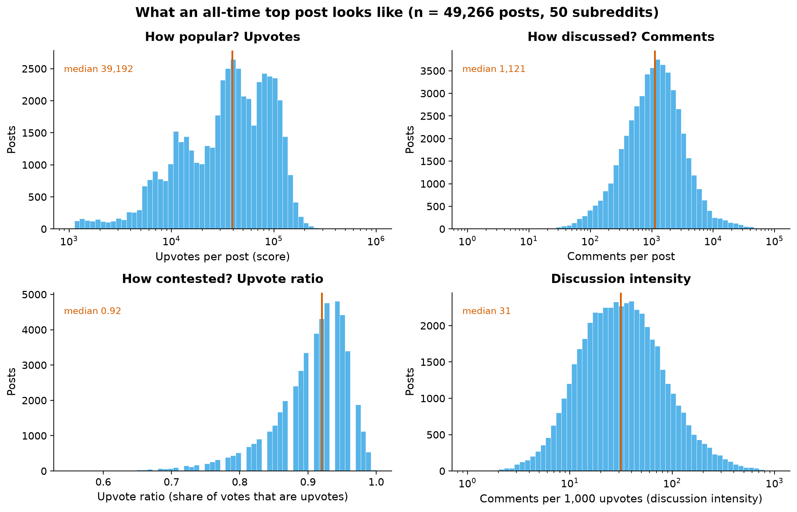

**What it shows.** Score and comments are heavily right-skewed (hence log scales); the upvote ratio is compressed near consensus (median 0.92); discussion intensity spans three orders of magnitude even among top posts. **Why it matters.** These distributions motivate our methodological choices — medians and log scales everywhere — and preview the story: the *shape* of engagement varies far more than the *level* of success. **Interpretation.** A "top post" is not one kind of object: some are approval machines, some are discussion machines.

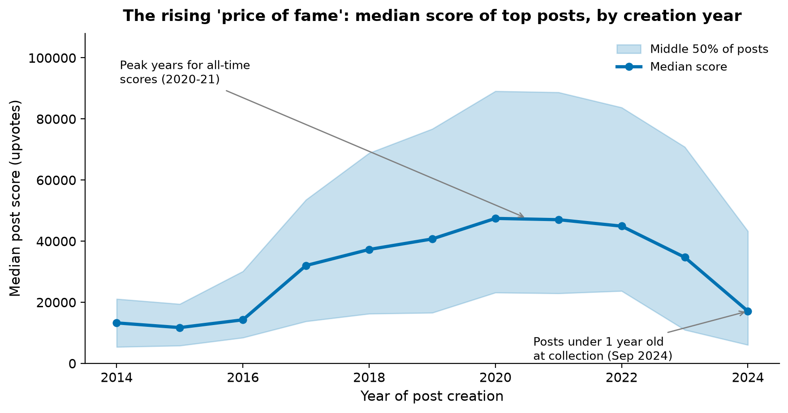

**What it shows.** The median top-post score roughly tripled from 13,254 (2014) to a 47,450 peak (2020), held near 45k through 2022, then falls to 17,101 in 2024. **Pattern & interpretation.** The rise tracks Reddit's audience growth — as the platform grew, so did the upvote ceiling of its biggest hits. The 2024 value is **not** evidence of decline: posts created in 2024 were at most a few months old at collection, still accumulating votes (accumulation-time bias, Section 2). We treat the 2020–21 plateau as the peak of the observable "price of fame".

### 5.2 Communities: consumers vs. discussants (Task Set 2 — Shrey)

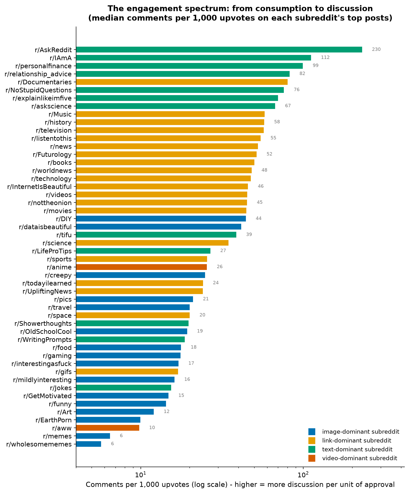

**What it shows.** A clean, wide spectrum. At the discussion end: AskReddit (230 comments/1k upvotes), IAmA (112), personalfinance (99), relationship_advice (82). At the consumption end: wholesomememes (5.7), memes (6.5), aww (9.8), EarthPorn (9.9). **Why it matters.** This single derived measure — comments per upvote — separates communities by *function*: Q&A and advice forums vs. visual feeds. **Pattern.** Colour (dominant post type) is almost perfectly separated along the spectrum: text-dominant communities at the top, image-dominant at the bottom. **Interpretation.** High-effort engagement (writing a comment) and low-effort engagement (an upvote) are alternative currencies, and communities specialise.

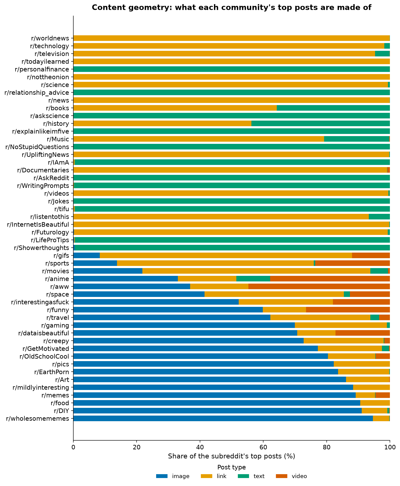

**What it shows.** Composition is structural, not incidental: AskReddit, NoStupidQuestions, personalfinance and relationship_advice are ~100% text; wholesomememes (94.6%), DIY (91.1%) and food (90.6%) are image-dominated; news communities are link-dominated. **Why it matters.** This figure establishes that "what a community's content is" is a stable, categorical property — the substrate on which engagement styles (Figure 4) operate. **Interpretation.** Reddit's largest communities divide into text-conversation spaces and media-feed spaces, with link-aggregators in between.

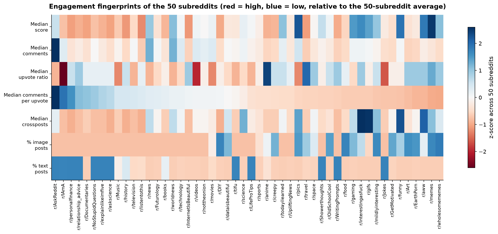

**What it shows.** Seven variables at once: median score, comments, upvote ratio, comments-per-upvote, crossposts, and image/text shares. The discussion-heavy block (left) is text-high, score-low, ratio-low; the consumption block (right) is image-high, score-high, ratio-high. **Why it matters.** This is the figure that shows engagement is *multidimensional* — no single column orders the communities; the *pattern across columns* does. **Pattern.** Visible anti-correlation between discussion intensity and score scale; crossposts are high where media is high. **Interpretation.** Communities face a scale-intensity trade-off: the median top post in our eight most discussion-heavy communities scores ~16k upvotes, versus ~100k in the ten most image-heavy ones — a ~6× gap.

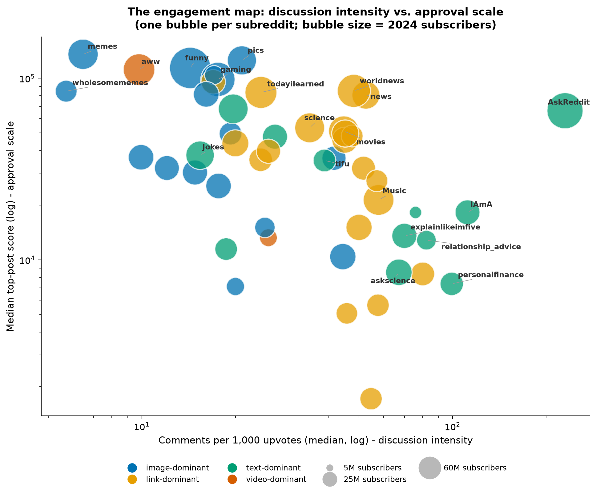

**What it shows.** Four visual variables (x, y, size, colour) position all 50 communities. The upper-right region — high score *and* high discussion — is occupied by a single outlier: **AskReddit** (63M subscriber scale, median top score 66k, 230 comments/1k). News hubs (worldnews, news) sit mid-spectrum with high scores; the visual feeds form a low-discussion, high-score band; advice communities sit lower-left (modest scores, real discussion). **Why it matters.** Size does not explain style: big bubbles appear at both ends of the discussion axis. **Interpretation.** AskReddit is structurally unique — its question format converts audience size into conversation at a rate no other mega-community matches. **Limitation.** Subscriber counts are a 2024 snapshot (Section 2), so size is context, not a temporal variable.

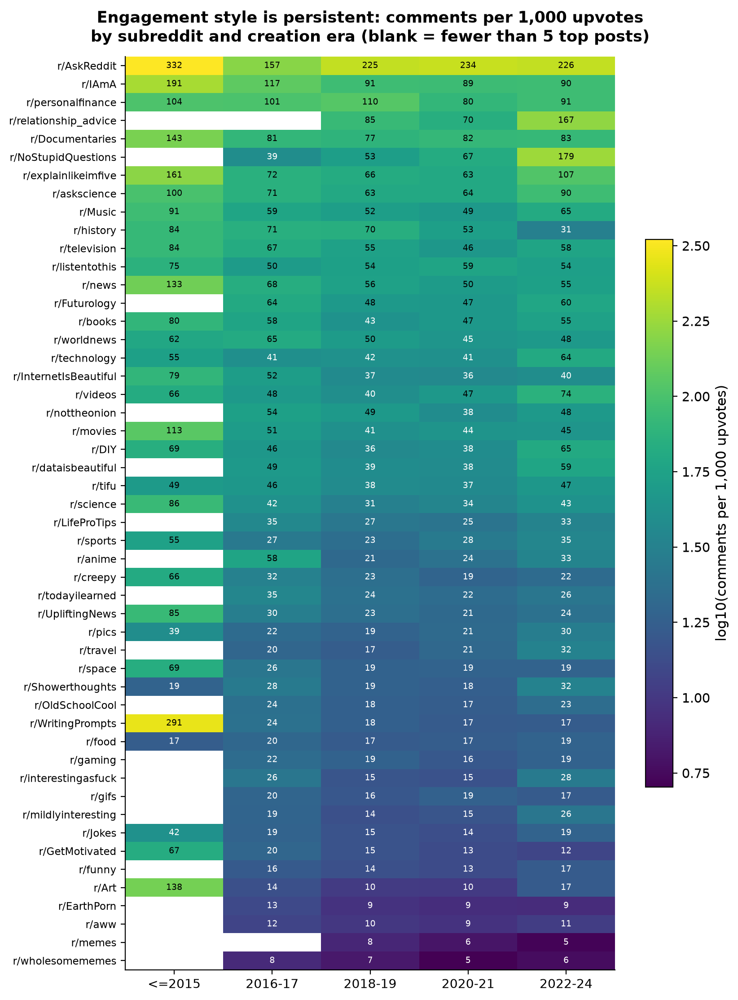

**What it shows.** The colour structure is almost perfectly vertical: each community's discussion intensity stays in its own band across eras. Rank correlation between each era's style ranking and the overall ranking: **+0.90 to +0.92** for 2016–2021, **+0.85** for 2022–24. **Why it matters.** This rules out the alternative explanation that the Figure 4 spectrum is an artefact of aggregating over time — communities kept their style even as the platform changed around them. **Interpretation.** Engagement style is a persistent community property, not a phase.

### 5.3 A decade of change — and what goes with what (Task Set 3 — Parthsarathi)

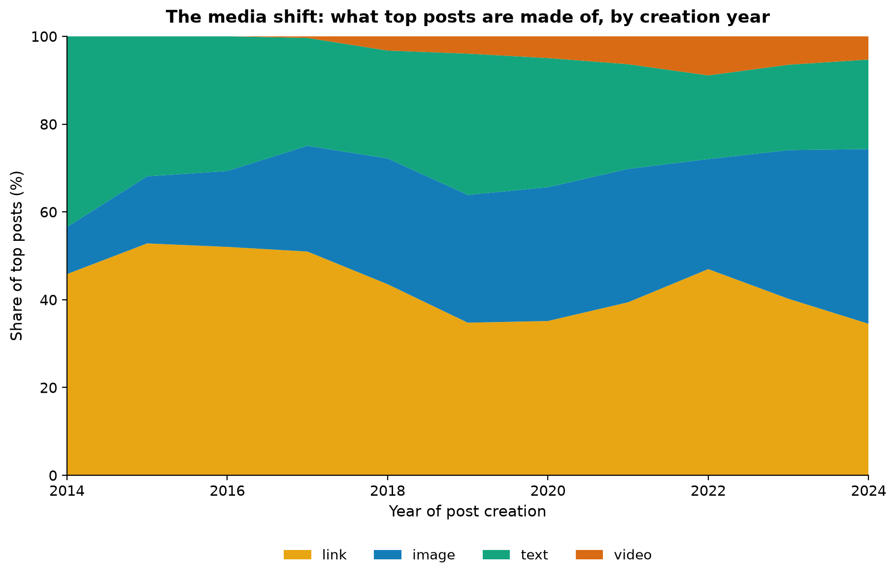

**What it shows.** Links dominated top posts in 2014–17 (46–53%) but fell to ~35% by 2019–24; images rose from 10.7% (2014) to ~30% (2019) and 39.8% (2024); video appears only after 2017 and reaches 5–9%. **Interpretation.** Reddit's biggest communities shifted from *pointing at the web* to *hosting media natively* — mirroring the platform's own product changes (Figure 10). Self-text held a steady ~25–30% share until 2021, then drifted down to ~20%.

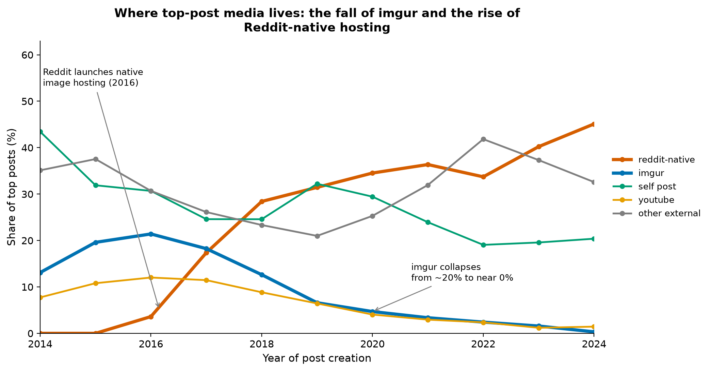

**What it shows.** A textbook platform migration: imgur — once Reddit's de-facto image host — supplied 19.6% of 2015's top posts but only 0.3% of 2024's; Reddit-native hosting (i.redd.it / v.redd.it) went from 0% to 45.1%. YouTube's share fell from ~11% to ~1.4%. **Why it matters.** The kink in the reddit-native line lands exactly at the 2016 product launch (verified against Reddit's public announcements [2][3]), which anchors our timeline in externally verifiable events. **Interpretation.** By the 2020s, top-post media on Reddit is overwhelmingly platform-internal — content that once left the site now stays on it. (The "other external" category, which grows after 2021, is dominated by news sites — theguardian.com, bbc.com, cnn.com — i.e., link posts in news communities, plus reddit.com crosspost links.)

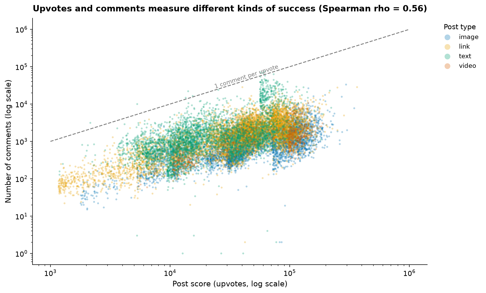

**What it shows.** Approval and participation are only moderately coupled (ρ = 0.56): at any score level, comment counts span two orders of magnitude. Nearly all posts sit far below the 1:1 line (the median top post gets ~31 comments per 1,000 upvotes), and text posts (green) reach the highest comment levels while image posts hug the bottom. **Interpretation.** "Success" on Reddit is not one currency. A 100k-upvote meme and a 20k-upvote AskReddit thread are both top posts, but they are different *kinds* of success — consumed vs. discussed. The type colouring previews the systematic version of this finding in Figures 4 and 13.

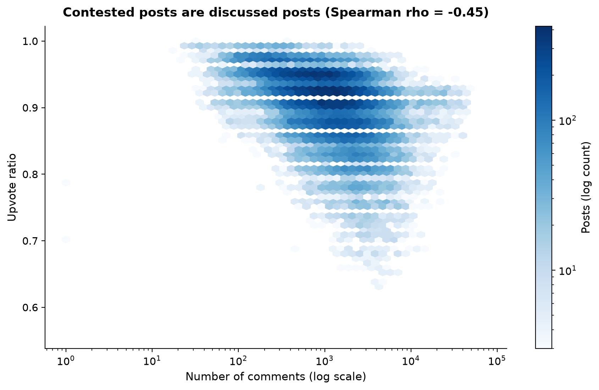

**What it shows.** A clear negative relationship: posts with many comments tend to have *lower* upvote ratios. The most unanimous communities (median ratio 0.97–0.98: travel, anime) are low-discussion feeds; the most contested (IAmA at 0.83) are conversation spaces. **Interpretation.** Where people talk, they also disagree — comment sections are where controversy lives, while image feeds produce near-unanimous approval. This is an association, not a causal claim: we cannot tell from these data whether controversy *drives* commenting or whether commenting communities simply host more divisive topics.

### 5.4 Synthesis: profiles and the age of fame (Member A — integrating Task Sets 2 and 3)

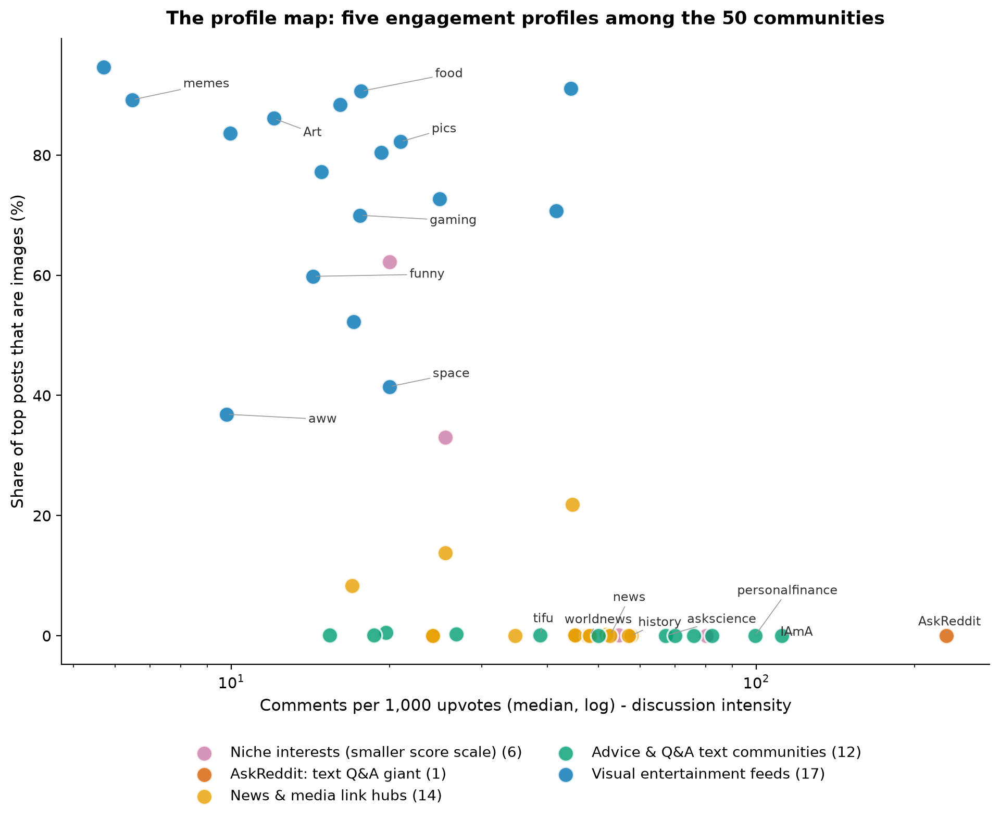

**What it shows.** Read the geometry first: even without the colouring, the 50 communities separate into visible bands along the two axes — image-heavy feeds along the top, text communities along the bottom, and AskReddit isolated at the far right. Colouring each dot by a k-means grouping (k = 5, chosen where the silhouette curve stops improving without fragmenting into singleton clusters — Appendix C) labels five interpretable profiles: **AskReddit alone** (text Q&A giant); **visual entertainment feeds** (17 communities: memes, aww, pics, funny, food, …); **advice & Q&A text communities** (12: personalfinance, relationship_advice, askscience, explainlikeimfive, tifu, …); **news & media link hubs** (14: worldnews, news, movies, technology, …); and **niche interest communities** with smaller score scales (6: history, Documentaries, travel, listentothis, anime, InternetIsBeautiful). **Why it matters.** The grouping is a *summary of visible structure*, not a discovery claim: the axes — content form × engagement mode — do the organising, and the clustering merely attaches labels to what the scatter already shows. The solution is stable across random seeds (mean adjusted Rand index 0.88). **Interpretation.** Reddit's largest communities occupy a small number of engagement niches; the axes of differentiation are *content form* and *engagement mode*, not community size.

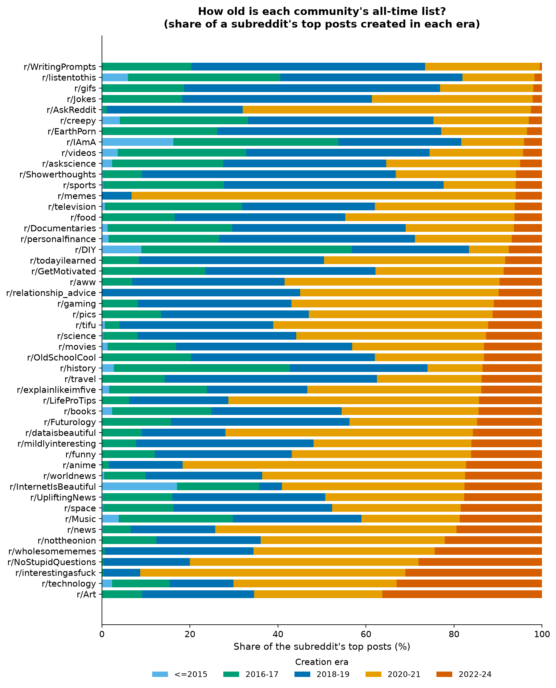

**What it shows.** All-time lists age at very different rates: 36.3% of r/Art's and 33.0% of r/technology's top posts were created in 2022–24, versus 0.5% for r/WritingPrompts and 1.7% for r/listentothis. **Why it matters.** Because every community faces the same accumulation clock (Figure 1), these differences are relative: they compare how quickly each community's recent output displaces its classics. **Interpretation.** Some communities have "moving ceilings" — their all-time bar is being reset by recent posts (Art, technology, interestingasfuck) — while others are dominated by long-standing classics (WritingPrompts, Jokes, AskReddit's own list is only 2.5% recent despite its volume). We note this pattern but flag the caveat that a short recent window (2022–24) makes single-percentage readings noisy.

## 6. Inferences and Findings

We separate what we **observed** from how we **interpret** it, and state confidence after each finding.

**F1 — Engagement style spans a 40× spectrum and is stable over time.**
*Observation:* median comments per 1,000 upvotes ranges from 5.7 (wholesomememes) to 230 (AskReddit); era-by-era style rankings correlate +0.85 to +0.92 with the overall ranking (Figs. 4, 8).
*Interpretation:* the largest Reddit communities occupy durable positions on a consumption-to-discussion spectrum determined by community function (Q&A/advice vs. visual feed). *Confidence: high* — robust to mean-vs-median (rank corr. 0.99) and consistent across all five eras.

**F2 — Success has (at least) two decoupled currencies: approval and participation.**
*Observation:* score and comments correlate only moderately (ρ = 0.56); at matched scores, comment counts span two orders of magnitude; text posts dominate the high-comment region (Fig. 11).
*Interpretation:* upvotes and comments measure different kinds of success; communities and post types specialise in one or the other. *Confidence: high.*

**F3 — Contested posts are discussed posts.**
*Observation:* upvote ratio falls as comments rise (ρ = −0.45); the most contested community (IAmA, median ratio 0.83) is a discussion space; the most unanimous (travel, anime, 0.97–0.98) are image feeds (Fig. 12).
*Interpretation:* commenting and disagreement co-occur — conversation is where Reddit's friction lives, while image feeds approach unanimous approval. We do not claim a causal direction. *Confidence: high for the association; the causal reading is explicitly avoided.*

**F4 — The platform migrated: top-post media moved inside Reddit.**
*Observation:* imgur's share of top posts fell 19.6% → 0.3% (2015 → 2024) while Reddit-native hosting rose 0% → 45.1%; links fell from ~52% to ~35% of top posts while images and video rose (Figs. 9, 10). The inflection matches Reddit's native image hosting launch (mid-2016) and native video launch (Aug 2017) [2][3].
*Interpretation:* Reddit's own product decisions reshaped what its biggest communities' hits are made of — by the 2020s, top content is overwhelmingly hosted on-platform. *Confidence: high* — anchored in externally verifiable platform events.

**F5 — The "price of fame" roughly tripled, then the record ends mid-sentence.**
*Observation:* median top-post score rose from ~13k (2014) to ~47k (2020–21), then drops to 17k in 2024 (Fig. 3).
*Interpretation:* the rise reflects Reddit's audience growth; the 2024 drop is a measurement artefact (posts < 1 year old at collection), not a decline. *Confidence: high on the numbers; the growth reading is consistent with, but not proven by, our data alone.*

**F6 — Content form is structural and maps onto engagement profiles.**
*Observation:* post-type composition is near-deterministic for many communities (100% text for four; > 90% images for three); on the profile map (Fig. 13) the communities separate into five visually distinct groups along content form × engagement mode, with the k-means colouring (k = 5, stable across seeds, mean ARI 0.88) providing the labels.
*Interpretation:* the axes that organise Reddit's biggest communities are content form × engagement mode — not size. *Confidence: high for the visual separation; the five-profile labelling is a descriptive summary, not a validated taxonomy.*

**F7 — Media travels; text stays home.**
*Observation:* video posts have a median of 18 crossposts and images 7, versus 1 for text posts; crossposts correlate with score (ρ = 0.65).
*Interpretation:* spread across communities is a media phenomenon — visual content is what crosses community borders on Reddit. *Confidence: high.* (Supporting statistics in the Appendix; the corresponding exploratory figure is in `images/extras/`.)

**F8 — All-time lists age at different speeds.**
*Observation:* 2022–24-era share of top posts ranges from 0.5% (WritingPrompts) to 36.3% (Art) (Fig. 14).
*Interpretation:* some communities' all-time bars are being reset by recent output; others are museum-like. The short recent window warrants caution on individual values. *Confidence: medium.*

## 7. Conclusion

A decade of all-time top posts shows that **Reddit's 50 largest communities do not generate engagement in one way — they occupy a small set of stable engagement niches.** At one end sit the discussion spaces (AskReddit, the advice and Q&A communities), which convert modest upvote totals into enormous conversation; at the other, the visual entertainment feeds, which convert massive approval into almost no conversation. Between them, news and media hubs aggregate the outside web, and a set of smaller-scale niche communities rounds out the map. These styles are persistent (rank-stable across eras at ρ ≈ 0.9) even while the *substrate* of top content changed decisively: links gave way to images and video, and third-party hosting (imgur, YouTube) gave way to Reddit's own infrastructure — a shift whose timing matches Reddit's 2016–17 product launches.

For the analyst, the practical answer to our question is: **measure engagement in more than one currency.** Upvotes, comments, consensus, and crossposts are partly decoupled — a post (or a community) can max out one while barely registering on another. Any single-metric ranking of "Reddit's top communities" would misrepresent how differently those communities succeed.

## 8. Limitations

- **Top-post-only corpus:** we observe only successes; no causal claims about what makes posts succeed.
- **Accumulation-time bias:** recent posts are under-scored and under-represented (Figs. 1, 3).
- **Snapshot subscriber counts:** community size is only a 2024 covariate.
- **UTC timestamps:** we did not analyse hour-of-day patterns because they would confound US time zones.
- **Profile grouping:** the five profiles are a visual summary formalised by k-means (silhouette 0.35; selection and stability in Appendix C) — descriptive, not a validated taxonomy.
- **Moderate correlations:** all reported associations are rank correlations on observational data.

## 9. Author Contributions

*(To be completed with real names; structure kept ready.)*

| Member | Contribution |
|---|---|
| **Sidhanth Prabhu (BT2024027)** — team lead | Data preparation pipeline (merging 50 files, dual-format date parsing, column triage, derived variables `cpi`, `era`, `domain_class`; preprocessing log); Task Set 1: corpus overview (Figures 1–3) and synthesis (Figures 13–14: profile map with the k-selection analysis in Appendix C, age of lists); findings F5, F8; co-authored F6; dataset description section; video: preprocessing walkthrough (first minute), synthesis segment, and conclusion. |
| **Shrey Modi (BT2024125)** | Task Set 2 (community comparison): derived the discussion-intensity measure, built Figures 4–8 (spectrum, content geometry, fingerprint heatmap, engagement map, style-persistence heatmap); findings F1–F3; co-authored F6; video segment on community comparison; Tableau dashboard co-demo. |
| **Parthsarathi Samanta (BT2024083)** | Task Set 3 (trends & relationships): platform/domain classification, Figures 9–12 (media shift, hosting migration, score-vs-comments, ratio-vs-comments); external verification of the platform-launch dates; findings F4, F7; video segment on trends and relationships. |

All members jointly: research question selection, task decomposition, candidate-figure review and final selection, narrative construction, report editing, and AI-declaration accuracy.

## 10. AI Declaration

Each team member submits a separate, honestly completed declaration; the
fillable forms are in `report/AI_declarations.md` (one per member:
Sidhanth Prabhu, Shrey Modi, Parthsarathi Samanta). The declarations must
reflect each member's actual AI usage. As a team-level statement: AI tools
assisted with code scaffolding, figure generation, and drafting; every
statistic, figure, and external fact cited in this report was computed or
verified by the team against the actual dataset and primary sources, and is
reproducible via `src/`. No data, results, or citations were fabricated.

## 11. References

[1] Schulz, H.-J., Nocke, T., Heitzler, M., & Schumann, H. (2013). A design space of visualization tasks. *IEEE Transactions on Visualization and Computer Graphics*, 19(12), 2366–2375. doi:10.1109/TVCG.2013.120

[2] Reddit (r/changelog). (2016). *Introducing image uploading beta* — native image hosting launched in beta, mid-2016. https://www.reddit.com/r/changelog/comments/4kuk2j/

[3] TechCrunch. (2017, August 17). *Reddit rolls out its own video platform.* https://techcrunch.com/2017/08/17/reddit-rolls-out-its-own-video-platform/

[4] Kanchan, S. (2024). *Reddit Top Posts: 50-Subreddit Analysis 2011–2024* [Data set]. Kaggle. https://www.kaggle.com/datasets/sachinkanchan92/reddit-top-posts-50-subreddit-analysis-2011-2024

## Appendix A — Tasks tried vs. implemented

Tried and implemented: all tasks T1.1–T1.5, T2.1–T2.4, and T3.1–T3.4 (Section 4). Tried and dropped: hour-of-day / weekday activity analysis (rejected: UTC timestamps would confound US time zones and mislead lay readers); subreddit-size vs. engagement-style regression (rejected: `subscribers` is a 2024 snapshot, ρ = −0.16, no defensible temporal reading); NSFW-content geography (only 2.4% of posts — too thin for a story thread); title-linguistics analysis (`title_len` vs. score ρ = −0.12 — too weak to be informative).

## Appendix B — Candidate figures not in the report

Seventeen candidate visualizations were generated; fourteen appear above. The three in `images/extras/` (documented in `images/README.md`) are: upvote-ratio box plots for the most contested vs. most unanimous communities (consensus contrasts also visible in Figures 6 and 12); the Spearman correlation matrix of post-level variables (the numbers it contains are cited in Sections 5.3 and 6 instead); and the crossposts-vs.-score scatter (finding F7 is reported numerically in the text).

## Appendix C — Choosing k for the profile map (Figure 13)

We standardised five community-level features (log discussion intensity, log
median score, median upvote ratio, image share, text share) and ran k-means
for k = 2…8 (10 restarts each):

| k | Silhouette | Cluster sizes |
|---|---|---|
| 2 | 0.302 | 21, 29 |
| 3 | 0.313 | 17, 14, 19 |
| 4 | 0.347 | 18, 19, 2, 11 |
| **5** | **0.354** | **6, 1, 14, 12, 17** |
| 6 | 0.389 | 5, 17, 6, 14, 1, 7 |
| 7 | 0.404 | 6, 15, 17, 4, 6, 1, 1 |
| 8 | 0.385 | 4, 10, 7, 4, 15, 2, 2, 6 |

k = 5 is the most detailed partition before further gains in silhouette come
only from isolating additional outliers as singleton or near-singleton
clusters (k = 6–7 carve out extra singletons beyond the structural outlier
AskReddit, which is already alone at k = 5). At k = 5 the four remaining
groups are well populated (6–17 members each) and interpretable. The k = 5
solution is stable across random seeds (mean adjusted Rand index 0.88 over
19 seeds). We therefore use the clustering as a *labelling of visually
evident structure* in Figure 13, not as a claim of true cluster structure.
